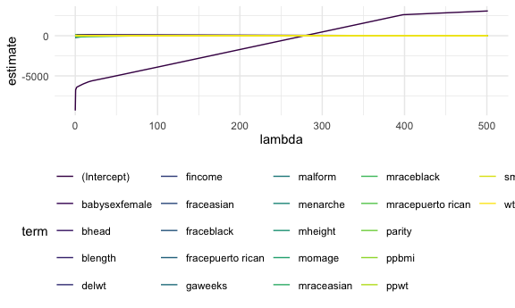
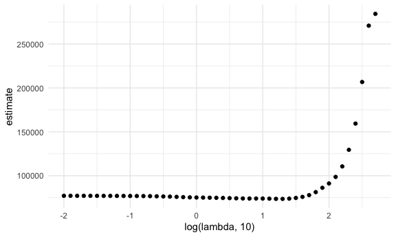

Statistical Learning
================
Yifei Yu
2024-10-29

``` r
knitr::opts_chunk$set(
  echo = TRUE,
  warning = FALSE,
  fig.width = 6,
  fig.asp = 0.6,
  out.width = "90%"
)

theme_set(theme_minimal() + theme(legend.position = "bottom"))

options(
  ggplot2.continuous.colour = "viridis",
  ggplot2.continuous.fill = "viridis"
)

scale_colour_discrete = scale_colour_viridis_d
scale_fill_discrete = scale_fill_viridis_d
```

load key packages.

``` r
library(tidyverse)
library(glmnet)
```

    ## Loading required package: Matrix

    ## 
    ## Attaching package: 'Matrix'

    ## The following objects are masked from 'package:tidyr':
    ## 
    ##     expand, pack, unpack

    ## Loaded glmnet 4.1-8

``` r
set.seed(1031)
```

### Try Lasso!

import and clean birthweight data

``` r
bwt_df =
  read_csv("data/birthweight.csv") |> 
  janitor::clean_names() |> 
  mutate(
    babysex =
      case_match(babysex,
                 1 ~ "male",
                 2 ~ "female"),
    babysex = fct_infreq(babysex),
    frace = 
      case_match(frace,
                 1 ~ "white",
                 2 ~ "black",
                 3 ~ "asian",
                 4 ~ "puerto rican",
                 5 ~ "other"),
    frace = fct_infreq(frace),
    mrace = 
      case_match(mrace,
                 1 ~ "white",
                 2 ~ "black",
                 3 ~ "asian",
                 4 ~ "puerto rican",
                 5 ~ "other"),
    mrace = fct_infreq(mrace)
  ) |> 
  sample_n(200)
```

    ## Rows: 4342 Columns: 20
    ## ── Column specification ────────────────────────────────────────────────────────
    ## Delimiter: ","
    ## dbl (20): babysex, bhead, blength, bwt, delwt, fincome, frace, gaweeks, malf...
    ## 
    ## ℹ Use `spec()` to retrieve the full column specification for this data.
    ## ℹ Specify the column types or set `show_col_types = FALSE` to quiet this message.

Construct inputs for `glmnet`

``` r
x = model.matrix(bwt ~ ., data = bwt_df)[, -1]
y = bwt_df |>  pull(bwt)
```

Fit lasso for several lambdas

``` r
lambda = 10^seq(-2, 2.75, by = 0.1)

lasso_fit = glmnet(x = x, y = y, lambda = lambda)

lasso_cv = 
  cv.glmnet(x = x, y = y, lambda = lambda)

lambda_opt = lasso_cv[["lambda_min"]]
```

Usual lasso plot

``` r
lasso_fit |> 
  broom::tidy() |> 
  filter(term != "(intercept)") |> 
  select(term, lambda, estimate) |> 
  complete(term, lambda, fill = list(estimate = 0)) |> 
  ggplot(aes(x = lambda, y = estimate, group = term, color = term)) +
  geom_vline(xintercept = lambda_opt, color = "red") +
  geom_line()
```



``` r
final_lasso_fit = 
  glmnet(x = x, y = y, lambda = lambda_opt)

final_lasso_fit |> 
  broom::tidy()
```

    ## # A tibble: 1,249 × 5
    ##    term         step estimate lambda dev.ratio
    ##    <chr>       <dbl>    <dbl>  <dbl>     <dbl>
    ##  1 (Intercept)     1    3086.   423.     0    
    ##  2 (Intercept)     2    2332.   385.     0.114
    ##  3 (Intercept)     3    1584.   351.     0.219
    ##  4 (Intercept)     4     902.   320.     0.306
    ##  5 (Intercept)     5     280.   291.     0.378
    ##  6 (Intercept)     6    -286.   265.     0.438
    ##  7 (Intercept)     7    -802.   242.     0.488
    ##  8 (Intercept)     8   -1272.   220.     0.529
    ##  9 (Intercept)     9   -1700.   201.     0.563
    ## 10 (Intercept)    10   -2090.   183.     0.592
    ## # ℹ 1,239 more rows

Look at cv results.

``` r
lasso_cv |> 
  broom::tidy() |> 
  ggplot(aes(x = log(lambda, 10), y = estimate)) +
  geom_point()
```


